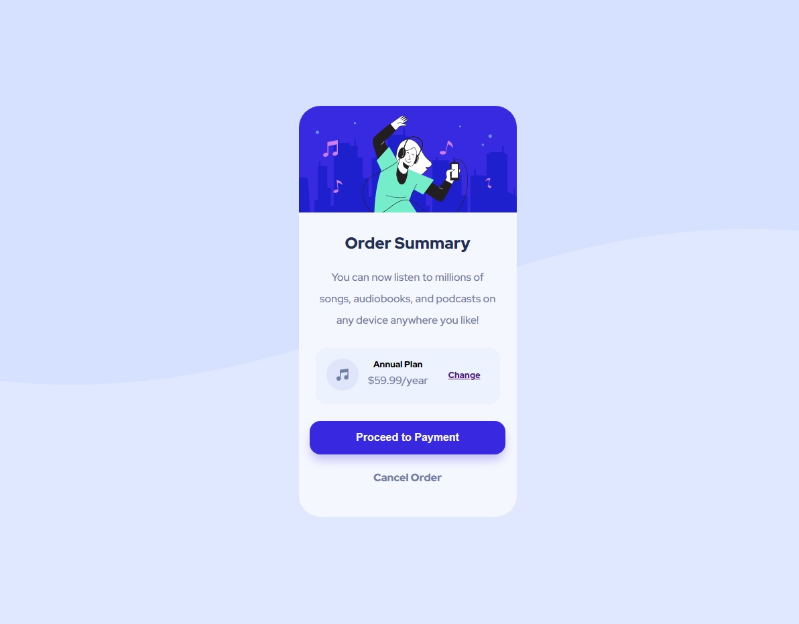

# Frontend Mentor - Order summary card solution

This is a solution to the [Order summary card challenge on Frontend Mentor](https://www.frontendmentor.io/challenges/order-summary-component-QlPmajDUj). 

## Table of contents

  - [The challenge](#the-challenge)
  - [Screenshot](#screenshot)
  - [Links](#links)
  - [Built with](#built-with)
  - [What I learned](#what-i-learned)
  - [Useful resources](#useful-resources)

### The challenge

Users should be able to:

- See hover states for interactive elements

### Screenshot




### Links

-  [Live Site URL:](https://your-live-site-url.com)


### Built with

- Semantic HTML5 markup
- CSS custom properties
- Flexbox
- Mobile-first workflow

### What I learned

A litte bit of Tree-structural pseudo-classes and some media quary

```css
section:nth-child(3)>ul li{
    margin-right: 0.9rem;
    font-weight: 900;
}
@media screen and (min-width: 1440px) {
    body {
      background-image: url(../images/pattern-background-desktop.svg);
      background-size: contain;
    }
  }
```


### Useful resources

- [Tree-structural pseudo-classes](https://developer.mozilla.org/en-US/docs/Web/CSS/Pseudo-classes) 

